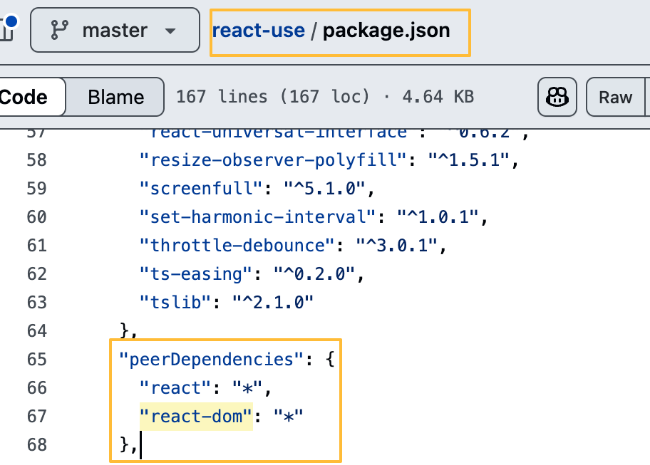

# dependencies, devdependencies

- dependencies와 devdependencies의 주요차이는 해당 패키지가 다른 패키지에서 설치될 때 설치되는가의 차이

### 1. Semver 버전 표기 방식

| 표기법     | 의미                                                                                                                                        |
| ---------- | ------------------------------------------------------------------------------------------------------------------------------------------- |
| `^1.2.3`   | 주 버전이 같다면 minor, patch 업데이트 허용                                                                                                 |
| `~1.2.3`   | patch 업데이트만 허용                                                                                                                       |
| `*` / `""` | 모든 버전 허용 → 항상 최신 버전 설치됨                                                                                                      |
| 1.2.3      | 버전이 정확하게 명시되어있기 때문에 npm update를 실행해도 버전이 변경되지 않는다. package-lock.json, node_modules에도 영향을 미치지 못한다. |

### 2. `dependencies`와 `devDependencies`의 차이

- `dependencies`: 패키지를 **실행(run-time)** 하기 위해 필요한 의존성입니다.
- `devDependencies`: 해당 패키지를 **개발할 때만 필요한 의존성**입니다.
- 즉, 이 패키지를 **사용하는 사람**이 아닌, **개발하는 사람(패키지 작성자)**이 필요로 하는 도구나 라이브러리입니다.

예시:

```json
// a 패키지
{
  "name": "a",
  "devDependencies": {
    "b": "1.1.0"
  }
}

// c 패키지
{
  "name": "c",
  "dependencies": {
    "a": "1.1.0"
  }
}
```

c는 a를 사용하지만, a의 devDependencies인 b는 설치되지 않습니다.

이유는 b는 a를 개발할 때만 필요한 도구이기 때문입니다.

이 개념을 전이되지 않는 의존성으로 해석했습니다.

즉 내가 만든 패키지를 npm에 배포하거나 다른 프로젝트에서 사용할 때(이 조건이 전제가 되어야함),
dependencies에 선언된 것은 함께 설치되므로 전이 의존성(transitive dependency)이 됩니다.하지만 devDependencies는 설치되지 않기 때문에 전이되지 않습니다.

## peerDependencies

peerDependencies는 실전에서 어떤 역할을 하나? peerDependencies는 단순한 의존성 선언이 아니라, 버전 충돌 방지를 위한 계약입니다.

예: react-use는 내부적으로 react에 강하게 의존하지만 peerDependencies로 선언

사용자(호스트)가 react의 정확한 버전을 직접 지정해야 하므로, 의도치 않은 중복 설치나 충돌을 방지할 수 있습니다. 그래서 peerDependencies는 호스트 패키지가 직접 의존성을 제공해야 한다는 것을 명시해야 합니다.


